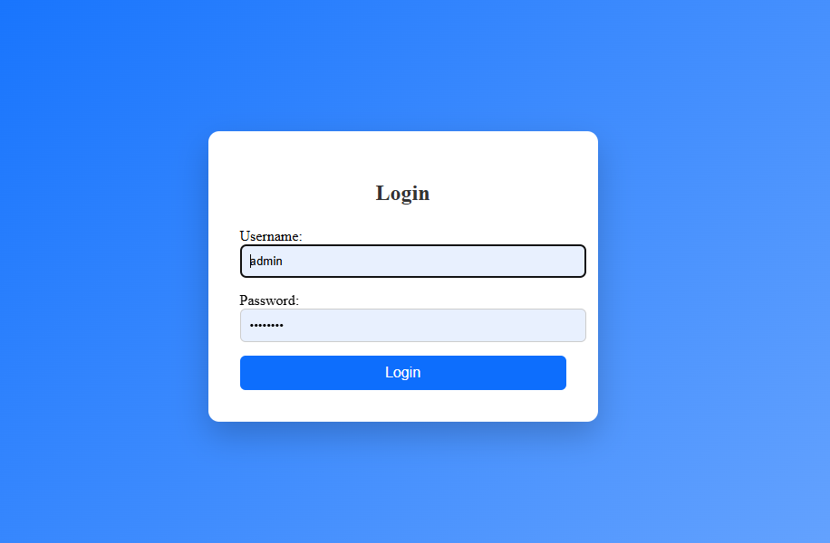
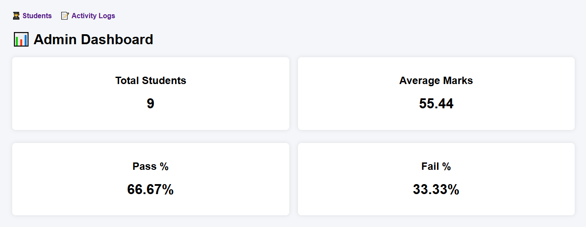

# Student Management System (Django)

A role-based Student Management System built using Django, implementing secure authentication, authorization, activity tracking, and analytics.

## 🔹 Features
- Role-Based Access Control (Admin / Teacher / Viewer)
- User Authentication & Authorization
- Student CRUD operations
- Activity logging using Django Signals
- Search, pagination, and filtering
- Export student data to CSV & Excel
- Admin analytics dashboard using Chart.js

## 🔹 Tech Stack
- Python, Django
- HTML, CSS, JavaScript
- SQLite
- Chart.js

## 📸 Screenshots

---
Developed by **Mansi Gurav**
